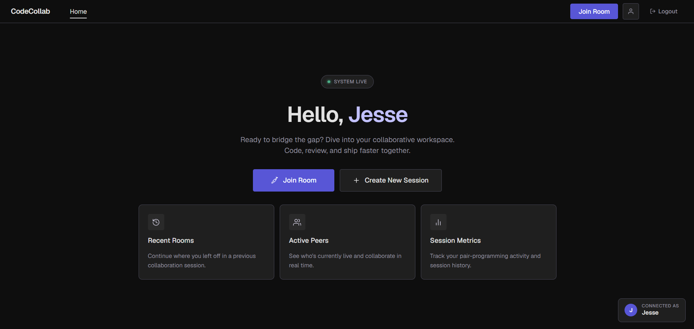
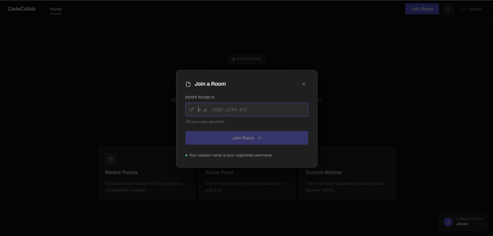
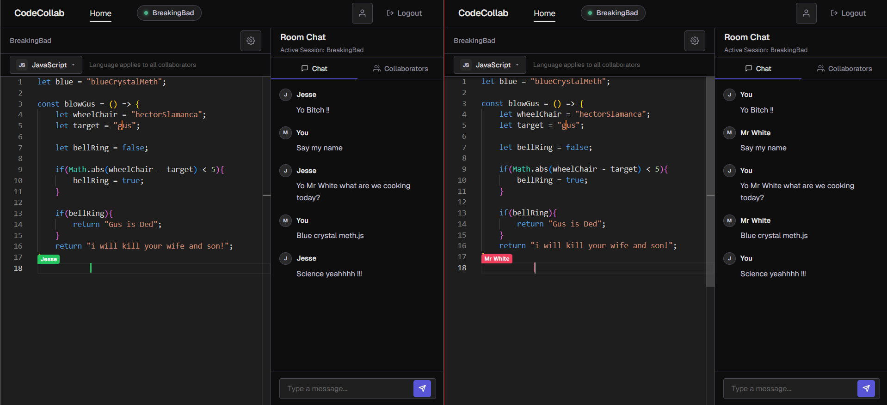
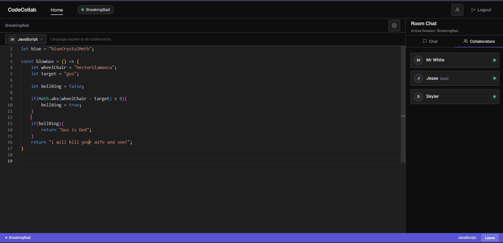

<div align="center">

<h1>
  <br/>
  CodeCollab
</h1>

<p><strong>Real-time collaborative code editor built for developers who ship together.</strong></p>

<p>
  Write, review, and debug code simultaneously with your team — every keystroke synced instantly, no conflicts, no lag.
</p>

<br/>



<br/>

[](https://openjdk.org/)
[](https://spring.io/projects/spring-boot)
[](https://react.dev/)
[](https://vitejs.dev/)
[](https://yjs.dev/)
[](https://developer.mozilla.org/en-US/docs/Web/API/WebSockets_API)

</div>

---

## Overview

CodeCollab is a full-stack collaborative coding environment where multiple developers can edit the same file in real time. Changes propagate instantly using a WebSocket transport layer and a CRDT-based document model — meaning edits from different users are always merged correctly, with no last-write-wins conflicts.

Built with a **Deep Obsidian** design system: true-black surfaces, Geist typography, and indigo accent — designed to feel like a professional developer workspace, not a prototype.

---

## Screenshots

<table>
  <tr>
    <td align="center" width="50%">
      
      <br/><sub><b>Home — personalised dashboard</b></sub>
    </td>
    <td align="center" width="50%">
      
      <br/><sub><b>Join a Room modal</b></sub>
    </td>
  </tr>
  <tr>
    <td align="center" width="50%">
      
      <br/><sub><b>Editor — live collaboration with collaborators panel</b></sub>
    </td>
    <td align="center" width="50%">
      
      <br/><sub><b>Two-user session — named cursors and real-time chat</b></sub>
    </td>
  </tr>
</table>

---

## Features

- **Real-time collaborative editing** — multiple users type simultaneously in the same editor, changes sync within milliseconds
- **CRDT conflict resolution** — powered by Yjs, edits are merged automatically with zero conflicts regardless of network timing
- **Named remote cursors** — each collaborator gets a distinct color; their username appears as a floating label when they move or type, fading out after 2.5 seconds
- **Language switcher** — change syntax highlighting across all room members in real time (JavaScript, Python, Java, C++)
- **Room-based sessions** — join any room by ID; room state (code + chat history) persists on the server for the session lifetime
- **Real-time chat** — per-room message thread with Chat and Collaborators tabs
- **Live presence** — see who is currently connected in the Collaborators panel with green presence indicators
- **JWT authentication** — register and log in; sessions are protected by signed JWT tokens
- **Deep Obsidian UI** — premium developer-centric dark theme with Geist typeface

---

## Tech Stack

### Frontend

| Technology | Version | Purpose |
|---|---|---|
| [React](https://react.dev/) | 19 | UI component framework |
| [Vite](https://vitejs.dev/) | 8 | Build tooling and dev server |
| [Monaco Editor](https://microsoft.github.io/monaco-editor/) | 0.55 | VS Code's editor engine embedded in the browser |
| [Yjs](https://yjs.dev/) | 13.6 | CRDT shared document model |
| [y-monaco](https://github.com/yjs/y-monaco) | 0.1 | Monaco ↔ Yjs binding |
| [y-protocols](https://github.com/yjs/y-protocols) | 1.0 | Yjs sync/awareness protocol primitives |
| Native WebSocket API | — | Real-time transport to the backend |

### Backend

| Technology | Version | Purpose |
|---|---|---|
| [Java](https://openjdk.org/) | 17 | Runtime language |
| [Spring Boot](https://spring.io/projects/spring-boot) | 3.4.5 | Application framework |
| [Spring WebSocket](https://docs.spring.io/spring-framework/docs/current/reference/html/web.html#websocket) | — | Raw WebSocket handler (`/chat` endpoint) |
| [Spring Security](https://spring.io/projects/spring-security) | — | Auth filter chain and CORS configuration |
| [Spring Data JPA](https://spring.io/projects/spring-data-jpa) | — | User entity persistence |
| [H2 Database](https://h2database.com/) | — | In-memory relational DB for development |
| [JJWT](https://github.com/jwtk/jjwt) | 0.12.5 | JWT generation and validation |
| [Lombok](https://projectlombok.org/) | — | Boilerplate reduction (getters, builders) |
| [Jackson](https://github.com/FasterXML/jackson) | 2.17 | JSON serialization of WebSocket messages |

---

## How It Works

### WebSocket Transport

The server exposes a single raw WebSocket endpoint at `ws://localhost:8080/chat`. All real-time communication flows through this channel using a typed JSON message protocol:

```
JOIN          → user enters a room; server sends back ROOM_STATE
LEAVE         → user exits a room
YJS_UPDATE    → binary Yjs document delta (base64-encoded)
CURSOR_MOVE   → { lineNumber, column, username }
LANGUAGE_CHANGE → { language }
CHAT          → { content, sender }
ROOM_STATE    → initial snapshot { yjsUpdates[], messages[], language, users[] }
ROOM_USERS    → live collaborator list update
```

The backend `ChatWebSocketHandler` routes each message to the appropriate service and broadcasts updates to all other members of the same room.

### CRDT with Yjs

CodeCollab uses **Yjs** — a production-grade CRDT (Conflict-free Replicated Data Type) library — to handle concurrent editing without operational transformation or central conflict resolution.

**How it works:**

1. Each client maintains a local `Y.Doc` with a shared `Y.Text` type bound to the Monaco model via `y-monaco`'s `MonacoBinding`
2. When any user types, Yjs computes a binary **delta update** representing only the change
3. The delta is base64-encoded and sent to the server as a `YJS_UPDATE` message
4. The server stores all updates in order and broadcasts them to every other client in the room
5. Each receiving client calls `Y.applyUpdate()` — Yjs merges the delta into the local document using CRDT semantics, meaning **concurrent edits from different users always converge to the same state** regardless of arrival order
6. On join, the server replays all stored `yjsUpdates[]` to reconstruct the full document state

**Why CRDT over OT (Operational Transformation)?**

- No central authority needed to resolve conflicts — every client can apply any update independently
- Commutative and associative by design — order of application doesn't matter
- Network partition tolerant — clients can diverge and re-sync without data loss

### Named Remote Cursors

Remote cursor positions are broadcast via `CURSOR_MOVE` messages. Each user gets a deterministic color from a hash of their username. Cursors render directly inside Monaco using the decoration API:

- A 2px colored vertical bar marks the exact cursor position
- A floating username pill (same color) appears above the cursor on every move
- The label auto-fades after **2.5 seconds** of inactivity — reappears on the next keystroke
- All styles are injected dynamically into the document via a per-user CSS stylesheet — no DOM manipulation

---

## Project Structure

```
code-collab/
├── backend/                         # Spring Boot application
│   └── src/main/java/backend/
│       ├── config/
│       │   ├── SecurityConfig.java  # CORS, auth filter, permit rules
│       │   └── WebSocketConfig.java # WebSocket endpoint registration
│       ├── controller/
│       │   └── AuthController.java  # /auth/register, /auth/login
│       ├── dto/                     # Request/response payload records
│       ├── entity/
│       │   └── UserEntity.java      # JPA user model
│       ├── handler/
│       │   └── ChatWebSocketHandler.java  # Core WS message router
│       ├── model/
│       │   ├── Room.java            # In-memory room state
│       │   ├── CodeEditorState.java # Yjs updates + language per room
│       │   ├── ChatMessage.java     # Chat message record
│       │   └── User.java            # Connected user record
│       ├── repository/
│       │   └── UserRepository.java  # Spring Data JPA
│       ├── service/
│       │   ├── AuthService.java     # Register/login, JWT issuance
│       │   ├── CodeEditorService.java # Yjs update storage + replay
│       │   └── RoomService.java     # Room lifecycle management
│       └── utility/
│           └── JwtUtil.java         # Token sign/verify
│
└── frontend/                        # React + Vite application
    └── src/
        ├── App.jsx                  # Root — auth routing + home shell
        ├── components/
        │   ├── LoginPage.jsx        # Auth — sign in
        │   ├── RegisterPage.jsx     # Auth — create account
        │   ├── RoomModal.jsx        # Join room by ID
        │   ├── RoomPage.jsx         # Editor + chat layout
        │   ├── CodeEditor.jsx       # Monaco + Yjs + cursor rendering
        │   └── ChatPanel.jsx        # Chat and collaborators tabs
        ├── services/
        │   ├── authService.js       # REST auth + JWT storage
        │   └── websocketService.js  # WS connect/send/subscribe
        └── index.css                # Deep Obsidian design system tokens
```

---

## Getting Started

### Prerequisites

- Java 17+
- Node.js 18+
- Maven (or use the included `mvnw` wrapper)

### Backend

```bash
cd backend
./mvnw spring-boot:run
```

The server starts on `http://localhost:8080`.  
H2 console available at `http://localhost:8080/h2-console` (JDBC URL: `jdbc:h2:mem:codecollab`).

### Frontend

```bash
cd frontend
npm install
npm run dev
```

The dev server starts on `http://localhost:5173`.

---

## Environment Notes

- **Database** — H2 in-memory. All data resets on server restart. To persist across restarts, swap the datasource to a file-based H2 or PostgreSQL.
- **JWT secret** — set in `application.properties` as `jwt.secret`. Change this before any deployment.
- **CORS** — currently configured to allow all origins for local development. Restrict in `SecurityConfig.java` for production.

---

## Design System

The UI uses the **Deep Obsidian** design system — a developer-centric dark theme built on:

- **True black** surfaces (`#0e0e0e` base, `#1f1f1f` containers)
- **Geist** typeface by Vercel — optimized for technical readability
- **Electric Indigo** (`#5856D6`) as the single accent color
- 4px spacing grid with `clamp()`-based responsive gaps
- Tonal layering for depth — no traditional shadows

---

<div align="center">

Built with ☕ and bad TV references

</div>
